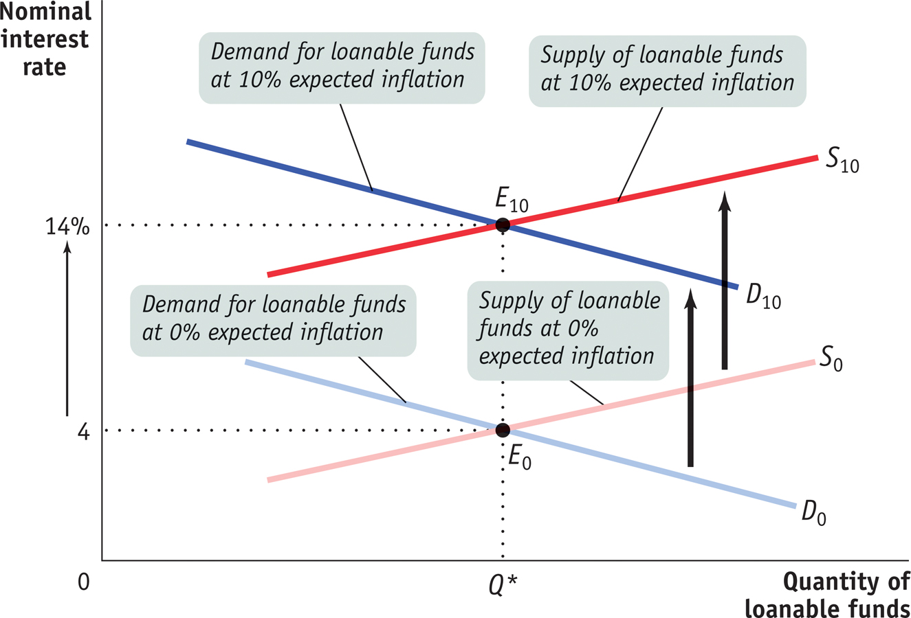

* Discuss financial markets

* Investment spending by firms = savings by households, govt, and foreign 
countries.

* Interest rates set as market equilibrium

  * Discuss shifts to supply and demand of loanable funds

  * Discuss effects of changes in expected inflation

* Govt borrowing, debt ceiling, and fiscal cliff

# Federal Deficit

# Debt to GDP ratio

# Total Federal debt

