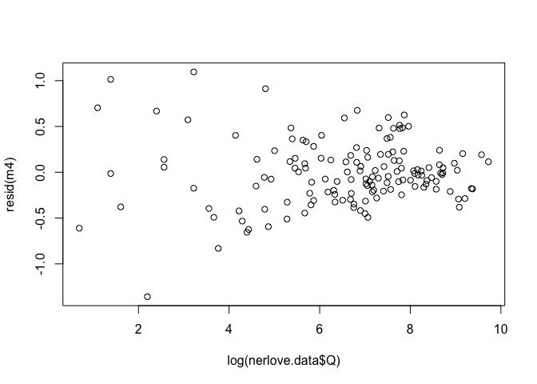
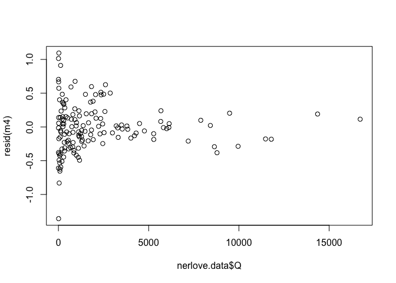

First load the data and create a factor to represent the different dummy
variables and matrix stacking operations that Hayashi recommends.


nerlove.data <- read.csv("4-ols-normality.git/nerlove-data.csv")
nerlove.data[["g"]] <- factor(rep(1:5, each = 29))


Some small points...

- I'm going to skip the questions that don't involve R. This is just about
  showing you some new R commands.
- It's a good idea to be explicit about notation. The variables are explained on
  page 62 of Hayashi and are...

  -   `TC` is the obvious \(TC_i\) (Total costs for firm \(i\)) in Hayashi
  -   `Q` is \(Q_i\), firm output
  -   `PL` is \(p_{i1}\), cost of labor input
  -   `PK` is \(p_{i2}\), cost of capital input
  -   `PF` is \(p_{i3}\), cost of fuel. (Which we're going to use as a normalization under constant returns to scale.)

I'm not writing these definitions out to be pendantic or for the reader's benefit (but it helps the reader for sure), it's mostly so that I know where to look them up as I complete the exercise. Make sure to record important information somewhere you can be sure to find it again.

**Also, a list of useful documentation:**

-   *Introduction to R* (official documentation), Section on [Statistical models in R](https://cran.r-project.org/doc/manuals/R-intro.html#Statistical-models-in-R)
-   [Model formulae](https://stat.ethz.ch/R-manual/R-devel/library/stats/html/formula.html) (official documentation), also available as `?formula`
-   [Fitting linear models](https://stat.ethz.ch/R-manual/R-devel/library/stats/html/lm.html) (official documentation), also available as `?lm`. The help file will direct you to [summary.lm](https://stat.ethz.ch/R-manual/R-devel/library/stats/html/summary.lm.html), [anova.lm](https://stat.ethz.ch/R-manual/R-devel/library/stats/html/anova.lm.html), and [residuals](https://stat.ethz.ch/R-manual/R-devel/library/stats/html/residuals.html)
-   [Factors](https://stat.ethz.ch/R-manual/R-devel/library/base/html/factor.html) (official documentation) also available as `?factor`

For the future: the official introduction to R, available at <https://cran.r-project.org/manuals.html> is quite good. Skim it. There is also a very good [Econometrics Task View](https://cran.r-project.org/web/views/Econometrics.html) that lists packages that are especially useful for doing econometrics.

R isn't great for doing the probability modeling and simulations that made up most of our computer exercises for the first half of the class. (Although I'd argue that there aren't many good programs for that sort of specialized work in general.) But it is **fantastic** at doing the sort of applied regression analysis that we're going to do in the second half of the course (and you're going to do throughout your career.)

I'll point you to the important packages and functions for the next empirical homework. I'm impressed that y'all are hardcore enough to stay up all night finishing it, but that's not really what I wanted or intended.

Some people had really slick answers and approaches, much slicker than mine. I'd strongly encourage you to look at the answers your team members provided, especially if you struggled to answer one or more of the questions.

Question (b)
------------


summary(lm(log(TC) ~ log(Q) + log(PL) + log(PK) + log(PF), data = nerlove.data))


    ## 
    ## Call:
    ## lm(formula = log(TC) ~ log(Q) + log(PL) + log(PK) + log(PF), 
    ##     data = nerlove.data)
    ## 
    ## Residuals:
    ##      Min       1Q   Median       3Q      Max 
    ## -0.97203 -0.23377 -0.01091  0.16185  1.80985 
    ## 
    ## Coefficients:
    ##             Estimate Std. Error t value Pr(>|t|)    
    ## (Intercept) -3.56651    1.77938  -2.004    0.047 *  
    ## log(Q)       0.72091    0.01743  41.352  < 2e-16 ***
    ## log(PL)      0.45596    0.29980   1.521    0.131    
    ## log(PK)     -0.21515    0.33983  -0.633    0.528    
    ## log(PF)      0.42581    0.10032   4.244 3.97e-05 ***
    ## ---
    ## Signif. codes:  0 '***' 0.001 '**' 0.01 '*' 0.05 '.' 0.1 ' ' 1
    ## 
    ## Residual standard error: 0.3923 on 140 degrees of freedom
    ## Multiple R-squared:  0.926,  Adjusted R-squared:  0.9239 
    ## F-statistic: 437.9 on 4 and 140 DF,  p-value: < 2.2e-16

These answers are very close in a practical sense, but not close enough to be totally comfortable that we've actually replicated his results. (Numeric error is much smaller than this.)

After looking at the data set on Hayashi's website, <http://fhayashi.fc2web.com/datasets.htm>, I can see that I screwed up something very important that I should know to avoid by now: when you export data from Excel, it exports at the level of precision that **appears on the screen** and not what's in the original file. I must have used the default value, round to the first decimal point, when I exported the data to the csv file.

So, two lessons:

-   **My mistake:** I committed a terrible data analysis sin by not linking to the original data set. Mistakes happen, so it's important that you give readers the ability to check your work. I could have made that much easier and didn't.

-   **Your mistake:** Don't trust people, even your professors. We screw up. If I give you the wrong data, I look a little bad, but it's still your name on the analysis. Computers are astonishingly accurate and this difference is massive compared to reasonable approximation error.

I wish this were an intentional lesson but I definitely screwed up. Sorry.

Getting the correct data loaded is easy, though. (After some trial and error. The last line of the file is corrupted and I had to look at both files to make sure that the columns are in the same order.)


variables <- names(nerlove.data)[1:5]
nerlove.data <- read.delim(
    "http://fhayashi.fc2web.com/hayashi%20econometrics/ch1/NERLOVE.ASC",
    sep = "", head = FALSE, col.names = variables, nrows = 145)
nerlove.data[["g"]] <- factor(rep(1:5, each = 29))


Now check again


summary(lm(log(TC) ~ log(Q) + log(PL) + log(PK) + log(PF), data = nerlove.data))


    ## 
    ## Call:
    ## lm(formula = log(TC) ~ log(Q) + log(PL) + log(PK) + log(PF), 
    ##     data = nerlove.data)
    ## 
    ## Residuals:
    ##      Min       1Q   Median       3Q      Max 
    ## -0.97784 -0.23817 -0.01372  0.16031  1.81751 
    ## 
    ## Coefficients:
    ##             Estimate Std. Error t value Pr(>|t|)    
    ## (Intercept) -3.52650    1.77437  -1.987   0.0488 *  
    ## log(Q)       0.72039    0.01747  41.244  < 2e-16 ***
    ## log(PL)      0.43634    0.29105   1.499   0.1361    
    ## log(PK)     -0.21989    0.33943  -0.648   0.5182    
    ## log(PF)      0.42652    0.10037   4.249 3.89e-05 ***
    ## ---
    ## Signif. codes:  0 '***' 0.001 '**' 0.01 '*' 0.05 '.' 0.1 ' ' 1
    ## 
    ## Residual standard error: 0.3924 on 140 degrees of freedom
    ## Multiple R-squared:  0.926,  Adjusted R-squared:  0.9238 
    ## F-statistic: 437.7 on 4 and 140 DF,  p-value: < 2.2e-16

and this is exactly the same as the numbers printed in Hayashi's analysis.

Question (c)
------------

I'll save this model because we use it for testing in Question (f).


m0 <- lm(log(TC/PF) ~ log(Q) + log(PL/PF) + log(PK/PF), data = nerlove.data)
summary(m0)


    ## 
    ## Call:
    ## lm(formula = log(TC/PF) ~ log(Q) + log(PL/PF) + log(PK/PF), data = nerlove.data)
    ## 
    ## Residuals:
    ##      Min       1Q   Median       3Q      Max 
    ## -1.01200 -0.21759 -0.00752  0.16048  1.81922 
    ## 
    ## Coefficients:
    ##              Estimate Std. Error t value Pr(>|t|)    
    ## (Intercept) -4.690789   0.884871  -5.301 4.34e-07 ***
    ## log(Q)       0.720688   0.017436  41.334  < 2e-16 ***
    ## log(PL/PF)   0.592910   0.204572   2.898  0.00435 ** 
    ## log(PK/PF)  -0.007381   0.190736  -0.039  0.96919    
    ## ---
    ## Signif. codes:  0 '***' 0.001 '**' 0.01 '*' 0.05 '.' 0.1 ' ' 1
    ## 
    ## Residual standard error: 0.3918 on 141 degrees of freedom
    ## Multiple R-squared:  0.9316, Adjusted R-squared:  0.9301 
    ## F-statistic:   640 on 3 and 141 DF,  p-value: < 2.2e-16

Looks good.

Question (d)
------------

The easiest way is to estimate separate regressions for each group. You can either do this by hand or loop over all the groups. We'll also save some variables that we'll need later


returnsToScale <- numeric(5)
SSR <- numeric(5)
for (h in 1:5) {
    cat("Estimated model for group", h, "\n")
    cat("------------------------------------------------")
    mh <- lm(log(TC/PF) ~ log(Q) + log(PL/PF) + log(PK/PF),
        data = nerlove.data, subset = g == h)
    returnsToScale[h] <- unname(1 / coef(mh)["log(Q)"])
    SSR[h] <- sum(resid(mh)^2)
    print(summary(mh))
}


    ## Estimated model for group 1 
    ## ------------------------------------------------
    ## Call:
    ## lm(formula = log(TC/PF) ~ log(Q) + log(PL/PF) + log(PK/PF), data = nerlove.data, 
    ##     subset = g == h)
    ## 
    ## Residuals:
    ##      Min       1Q   Median       3Q      Max 
    ## -1.45553 -0.42260  0.03205  0.24483  1.09631 
    ## 
    ## Coefficients:
    ##             Estimate Std. Error t value Pr(>|t|)    
    ## (Intercept) -3.34335    3.14565  -1.063    0.298    
    ## log(Q)       0.40029    0.08445   4.740 7.31e-05 ***
    ## log(PL/PF)   0.61517    0.72934   0.843    0.407    
    ## log(PK/PF)  -0.08136    0.70636  -0.115    0.909    
    ## ---
    ## Signif. codes:  0 '***' 0.001 '**' 0.01 '*' 0.05 '.' 0.1 ' ' 1
    ## 
    ## Residual standard error: 0.5962 on 25 degrees of freedom
    ## Multiple R-squared:  0.5134, Adjusted R-squared:  0.455 
    ## F-statistic: 8.792 on 3 and 25 DF,  p-value: 0.0003741
    ## 
    ## Estimated model for group 2 
    ## ------------------------------------------------
    ## Call:
    ## lm(formula = log(TC/PF) ~ log(Q) + log(PL/PF) + log(PK/PF), data = nerlove.data, 
    ##     subset = g == h)
    ## 
    ## Residuals:
    ##      Min       1Q   Median       3Q      Max 
    ## -0.53000 -0.11119 -0.03839  0.16773  0.46445 
    ## 
    ## Coefficients:
    ##             Estimate Std. Error t value Pr(>|t|)    
    ## (Intercept)  -6.4890     1.4129  -4.593 0.000107 ***
    ## log(Q)        0.6582     0.1163   5.659 6.84e-06 ***
    ## log(PL/PF)    0.0938     0.2743   0.342 0.735227    
    ## log(PK/PF)    0.3779     0.2765   1.367 0.183877    
    ## ---
    ## Signif. codes:  0 '***' 0.001 '**' 0.01 '*' 0.05 '.' 0.1 ' ' 1
    ## 
    ## Residual standard error: 0.2424 on 25 degrees of freedom
    ## Multiple R-squared:  0.6328, Adjusted R-squared:  0.5887 
    ## F-statistic: 14.36 on 3 and 25 DF,  p-value: 1.215e-05
    ## 
    ## Estimated model for group 3 
    ## ------------------------------------------------
    ## Call:
    ## lm(formula = log(TC/PF) ~ log(Q) + log(PL/PF) + log(PK/PF), data = nerlove.data, 
    ##     subset = g == h)
    ## 
    ## Residuals:
    ##     Min      1Q  Median      3Q     Max 
    ## -0.4224 -0.1019  0.0144  0.1529  0.3453 
    ## 
    ## Coefficients:
    ##             Estimate Std. Error t value Pr(>|t|)    
    ## (Intercept)  -7.3329     1.6890  -4.342 0.000205 ***
    ## log(Q)        0.9383     0.1980   4.740 7.32e-05 ***
    ## log(PL/PF)    0.4023     0.1994   2.017 0.054556 .  
    ## log(PK/PF)    0.2500     0.1870   1.337 0.193337    
    ## ---
    ## Signif. codes:  0 '***' 0.001 '**' 0.01 '*' 0.05 '.' 0.1 ' ' 1
    ## 
    ## Residual standard error: 0.198 on 25 degrees of freedom
    ## Multiple R-squared:  0.5732, Adjusted R-squared:  0.522 
    ## F-statistic: 11.19 on 3 and 25 DF,  p-value: 7.626e-05
    ## 
    ## Estimated model for group 4 
    ## ------------------------------------------------
    ## Call:
    ## lm(formula = log(TC/PF) ~ log(Q) + log(PL/PF) + log(PK/PF), data = nerlove.data, 
    ##     subset = g == h)
    ## 
    ## Residuals:
    ##      Min       1Q   Median       3Q      Max 
    ## -0.21585 -0.05846 -0.01226  0.07459  0.20688 
    ## 
    ## Coefficients:
    ##             Estimate Std. Error t value Pr(>|t|)    
    ## (Intercept) -6.54605    1.16484  -5.620 7.57e-06 ***
    ## log(Q)       0.91204    0.10749   8.485 7.91e-09 ***
    ## log(PL/PF)   0.50696    0.18749   2.704   0.0121 *  
    ## log(PK/PF)   0.09335    0.16410   0.569   0.5745    
    ## ---
    ## Signif. codes:  0 '***' 0.001 '**' 0.01 '*' 0.05 '.' 0.1 ' ' 1
    ## 
    ## Residual standard error: 0.1206 on 25 degrees of freedom
    ## Multiple R-squared:  0.8726, Adjusted R-squared:  0.8573 
    ## F-statistic: 57.06 on 3 and 25 DF,  p-value: 2.526e-11
    ## 
    ## Estimated model for group 5 
    ## ------------------------------------------------
    ## Call:
    ## lm(formula = log(TC/PF) ~ log(Q) + log(PL/PF) + log(PK/PF), data = nerlove.data, 
    ##     subset = g == h)
    ## 
    ## Residuals:
    ##       Min        1Q    Median        3Q       Max 
    ## -0.296559 -0.110141  0.004141  0.088790  0.288699 
    ## 
    ## Coefficients:
    ##             Estimate Std. Error t value Pr(>|t|)    
    ## (Intercept) -6.71426    1.04632  -6.417 1.02e-06 ***
    ## log(Q)       1.04439    0.06498  16.072 1.09e-14 ***
    ## log(PL/PF)   0.60259    0.19730   3.054   0.0053 ** 
    ## log(PK/PF)  -0.28944    0.17487  -1.655   0.1104    
    ## ---
    ## Signif. codes:  0 '***' 0.001 '**' 0.01 '*' 0.05 '.' 0.1 ' ' 1
    ## 
    ## Residual standard error: 0.1503 on 25 degrees of freedom
    ## Multiple R-squared:  0.921,  Adjusted R-squared:  0.9116 
    ## F-statistic:  97.2 on 3 and 25 DF,  p-value: 6.529e-14

The estimated returns to scale are

    ## [1] 2.4981863 1.5194085 1.0657807 1.0964381 0.9574966

which matches Hayashi's reported values.

Question (e)
------------

Estimate **Model 2**, which I'll save for Question (f). Please please please don't try to trick R into stacking matrices for you by explicitly constructing dummy variables. Factors are the correct way to do dummy variables in R.


m2 <- lm(log(TC/PF) ~ g * (log(Q) + log(PL/PF) + log(PK/PF)),
    data = nerlove.data)
summary(m2)


    ## 
    ## Call:
    ## lm(formula = log(TC/PF) ~ g * (log(Q) + log(PL/PF) + log(PK/PF)), 
    ##     data = nerlove.data)
    ## 
    ## Residuals:
    ##      Min       1Q   Median       3Q      Max 
    ## -1.45553 -0.11728 -0.00078  0.13216  1.09631 
    ## 
    ## Coefficients:
    ##               Estimate Std. Error t value Pr(>|t|)    
    ## (Intercept)   -3.34335    1.65265  -2.023   0.0452 *  
    ## g2            -3.14563    2.46253  -1.277   0.2038    
    ## g3            -3.98959    3.14152  -1.270   0.2065    
    ## g4            -3.20270    3.44724  -0.929   0.3546    
    ## g5            -3.37091    2.73649  -1.232   0.2203    
    ## log(Q)         0.40029    0.04437   9.022 2.74e-15 ***
    ## log(PL/PF)     0.61517    0.38318   1.605   0.1109    
    ## log(PK/PF)    -0.08136    0.37110  -0.219   0.8268    
    ## g2:log(Q)      0.25786    0.15668   1.646   0.1023    
    ## g3:log(Q)      0.53799    0.31627   1.701   0.0914 .  
    ## g4:log(Q)      0.51175    0.28268   1.810   0.0726 .  
    ## g5:log(Q)      0.64410    0.14254   4.519 1.42e-05 ***
    ## g2:log(PL/PF) -0.52137    0.52194  -0.999   0.3198    
    ## g3:log(PL/PF) -0.21292    0.49633  -0.429   0.6687    
    ## g4:log(PL/PF) -0.10822    0.61963  -0.175   0.8616    
    ## g5:log(PL/PF) -0.01259    0.56212  -0.022   0.9822    
    ## g2:log(PK/PF)  0.45929    0.51514   0.892   0.3743    
    ## g3:log(PK/PF)  0.33136    0.47459   0.698   0.4863    
    ## g4:log(PK/PF)  0.17471    0.56512   0.309   0.7577    
    ## g5:log(PK/PF) -0.20808    0.52018  -0.400   0.6898    
    ## ---
    ## Signif. codes:  0 '***' 0.001 '**' 0.01 '*' 0.05 '.' 0.1 ' ' 1
    ## 
    ## Residual standard error: 0.3132 on 125 degrees of freedom
    ## Multiple R-squared:  0.9612, Adjusted R-squared:  0.9553 
    ## F-statistic: 163.1 on 19 and 125 DF,  p-value: < 2.2e-16

These are the same estimates as in Model 1, once you realize that (for example) the sum of the coefficients on `g2` and `(Intercept)` become the intercept term in the second fitted model.

We can also check that the SSRs are the same as in Model 1.


print(sum(SSR))


    ## [1] 12.26243


print(sum(resid(m2)^2))


    ## [1] 12.26243

Proof: if the coefficients are the same, the residuals must be too. The coefficients are *obviously* the same.

Question (f)
------------

`anova` seems to work correctly, matching Hayashi's numbers:


anova(m0, m2)


    ## Analysis of Variance Table
    ## 
    ## Model 1: log(TC/PF) ~ log(Q) + log(PL/PF) + log(PK/PF)
    ## Model 2: log(TC/PF) ~ g * (log(Q) + log(PL/PF) + log(PK/PF))
    ##   Res.Df    RSS Df Sum of Sq      F    Pr(>F)    
    ## 1    141 21.640                                  
    ## 2    125 12.262 16    9.3779 5.9747 1.451e-09 ***
    ## ---
    ## Signif. codes:  0 '***' 0.001 '**' 0.01 '*' 0.05 '.' 0.1 ' ' 1

We reject, btw.

Question (g)
------------

Estimate Model 3 and use it for testing. You've probably figured out the trick by now...


m3 <- lm(log(TC/PF) ~ g*log(Q) + log(PL/PF) + log(PK/PF), data = nerlove.data)
anova(m2, m3)


    ## Analysis of Variance Table
    ## 
    ## Model 1: log(TC/PF) ~ g * (log(Q) + log(PL/PF) + log(PK/PF))
    ## Model 2: log(TC/PF) ~ g * log(Q) + log(PL/PF) + log(PK/PF)
    ##   Res.Df    RSS Df Sum of Sq      F Pr(>F)
    ## 1    125 12.262                           
    ## 2    133 12.577 -8  -0.31488 0.4012 0.9181

again matches Hayashi, but now we don't reject. (The p-value is huge.)

Question (h)
------------

You may think that we can't use `lm` for this question, but we can. There is a `weights` argument.


m4 <- lm(log(TC/PF) ~ poly(log(Q), 2) + log(PL/PF) + log(PK/PF),
    data = nerlove.data, weights = 0.0565 + 2.1377/Q)
summary(m4)


    ## 
    ## Call:
    ## lm(formula = log(TC/PF) ~ poly(log(Q), 2) + log(PL/PF) + log(PK/PF), 
    ##     data = nerlove.data, weights = 0.0565 + 2.1377/Q)
    ## 
    ## Weighted Residuals:
    ##      Min       1Q   Median       3Q      Max 
    ## -0.73638 -0.05166 -0.00726  0.04467  0.77906 
    ## 
    ## Coefficients:
    ##                  Estimate Std. Error t value Pr(>|t|)    
    ## (Intercept)        0.2254     1.2315   0.183    0.855    
    ## poly(log(Q), 2)1  16.7474     0.4823  34.726  < 2e-16 ***
    ## poly(log(Q), 2)2   2.7693     0.4199   6.595 8.05e-10 ***
    ## log(PL/PF)         0.3938     0.2898   1.359    0.176    
    ## log(PK/PF)        -0.3613     0.2706  -1.335    0.184    
    ## ---
    ## Signif. codes:  0 '***' 0.001 '**' 0.01 '*' 0.05 '.' 0.1 ' ' 1
    ## 
    ## Residual standard error: 0.151 on 140 degrees of freedom
    ## Multiple R-squared:  0.9322, Adjusted R-squared:  0.9303 
    ## F-statistic: 481.4 on 4 and 140 DF,  p-value: < 2.2e-16

Using `poly` is a bit more reliable than adding `I(log(Q)^2)` since it creates orthogonal polynomials. This also means that the reported coefficients will be different, but the fitted values and partial effects (which is what we care about) are the same.

And then the graph. There's not much heteroskedasticity visible in this graph, but a test would probably pick up on the lower volatility for the largest values of \(Q_i\).


plot(resid(m4) ~ log(nerlove.data$Q))


And this becomes more dramatic if we plot the residuals against \(Q_i\) in levels.


plot(resid(m4) ~ nerlove.data$Q)


