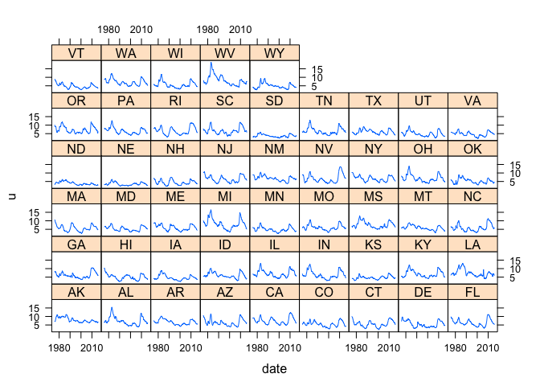
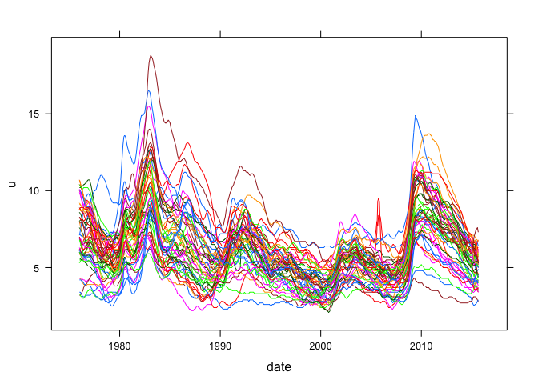
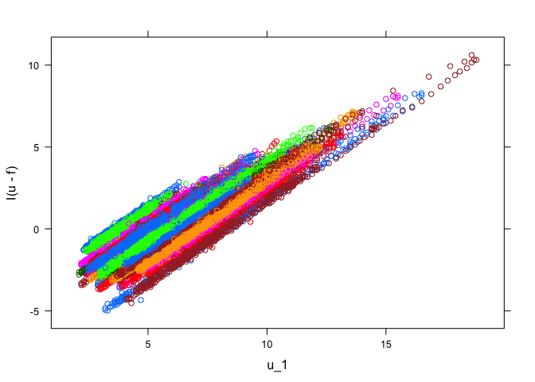
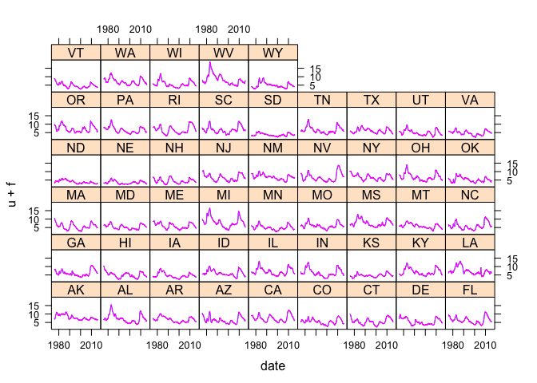
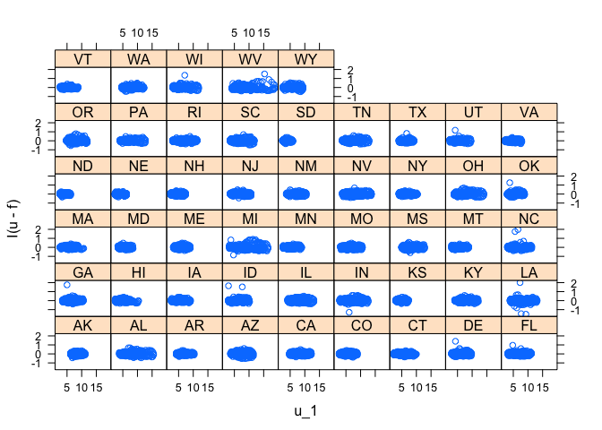

First, you need to install and load some packages. Install first if you need to:


## Doesn't evaluate by default; run it if you need to.
install.packages(c("quantmod", "dplyr"), dependencies = TRUE)


Then load them.


require(quantmod)
require(dplyr)


The quantmod package will let us download data directly from the FRED database. The state unemployment series are called "ALUR", "AKUR", etc. in the database. Other state-level variables follow the same naming scheme: state abbreviation followd by variable name.

Before worrying about the state-level data, though, let's define the function 'getdata' to retrieve an individual series from the FRED database and reformat it to make it a little more convenient.


getdata <- function(v, label = v) {
    ## Create a missing value for the period we want to predict
    target <- xts(NaN, as.Date("2015-10-01"))
    
    ## Download data from FRED and coerce to data.frame
    tsdata <- c(getSymbols(v, src="FRED", auto.assign=FALSE), target)
    d <- data.frame(row.names = NULL, as.Date(index(tsdata)),coredata(tsdata))
    names(d) <- c("date", label)
    tbl_df(d)
}


Next, a convenience wrapper for state-level data so that we don't need to call 'getdata' 50 times for each series.


statedata <- function(v, label = v) {
    ## For each state abbreviation, download data from FRED and store as a list
    ## of data frames, then stack them with rbind.
    lapply(state.abb, function(s) {
        getdata(paste(s, v, sep=""), label) %>% mutate(state = s)}) %>%
        do.call(rbind,.)
}


We can use our new function to download the unemployment rate.


d <- statedata("UR", "u")
glimpse(d)


    ## Observations: 23,900
    ## Variables: 3
    ## $ date  (date) 1976-01-01, 1976-02-01, 1976-03-01, 1976-04-01, 1976-05...
    ## $ u     (dbl) 6.9, 6.7, 6.6, 6.5, 6.4, 6.5, 6.6, 6.8, 6.9, 7.0, 7.2, 7...
    ## $ state (chr) "AL", "AL", "AL", "AL", "AL", "AL", "AL", "AL", "AL", "A...

A brief digression on the `%>%` operator
----------------------------------------

The `%>%` operator (called a 'pipe') is provided by dplyr but is defined in the magrittr package. If `A` is an object or expression and `f` is a function, the command


A %>% f


is equivalent to


f(A)


If `f` takes arguments, `%>%` feeds its left-hand side expression into the first argument of `f`, so


A %>% f(B, C, D)


is the same as


f(A, B, C, D)


If you want to set an argument other thn the first, you can use `.` as a placeholder, so


A %>% f(B, C, D, .)


is the same as


f(B, C, D, A)


By now you are probably wondering why this is useful. Well, it is pretty common to apply lots of functions in a row when you're transforming data, often with lots of arguments. In that case, using `%>%` to write the transformations sequentially can lead to much simpler code than nesting the functions:


d %>% firstfunction(oneargument, anotherargument) %>%
    secondfunction(some, more, arguments) %>%
    thirdfunction(thereare, somemore, . , argumentz, inhere) -> newd


instead of


newd <- thirdfunction(thereare, somemore,
    secondfunction(firstfunction(d, oneargument, anotherargument),
        some, more, arguments),
    argumentz, inhere)


This is especially true when you consider how we usually write these expressions, which is to start with the initial transformation and make sure that works, then add the second transformation, and finally the third. This writing process works perfectly with pipes, but becomes super awkward with heavily nested function calls.

I'll use it throughout this document because I find it easier for a lot of expressions. I'll also use the right assignment operator `->` because I find it very natural in pipes.

Digression over. How to forecast
--------------------------------

Before worrying about making good predictions, let's solve the much less ambitious problem of making bad predictions. Here's a start:


m_bad <- lm(u ~ 1, data = d)
summary(m_bad)


    ## 
    ## Call:
    ## lm(formula = u ~ 1, data = d)
    ## 
    ## Residuals:
    ##     Min      1Q  Median      3Q     Max 
    ## -3.9697 -1.4697 -0.3697  1.1303 12.7303 
    ## 
    ## Coefficients:
    ##             Estimate Std. Error t value Pr(>|t|)    
    ## (Intercept)  6.06970    0.01356   447.6   <2e-16 ***
    ## ---
    ## Signif. codes:  0 '***' 0.001 '**' 0.01 '*' 0.05 '.' 0.1 ' ' 1
    ## 
    ## Residual standard error: 2.094 on 23849 degrees of freedom
    ##   (50 observations deleted due to missingness)

(Note that the `NaN` observations were dropped, which is the behavior we want in this situation. In others we might not.)

How do we make a prediction? With the "predict" function, of course. We'll want to pull out the subset of our data `d` corresponding to the month we want to forecast, "2015-10-01", and feed it into the predict function along with `m_bad`. Here's how it works.


filter(d, date == "2015-10-01") %>% predict(m_bad, .)


    ##        1        2        3        4        5        6        7        8 
    ## 6.069698 6.069698 6.069698 6.069698 6.069698 6.069698 6.069698 6.069698 
    ##        9       10       11       12       13       14       15       16 
    ## 6.069698 6.069698 6.069698 6.069698 6.069698 6.069698 6.069698 6.069698 
    ##       17       18       19       20       21       22       23       24 
    ## 6.069698 6.069698 6.069698 6.069698 6.069698 6.069698 6.069698 6.069698 
    ##       25       26       27       28       29       30       31       32 
    ## 6.069698 6.069698 6.069698 6.069698 6.069698 6.069698 6.069698 6.069698 
    ##       33       34       35       36       37       38       39       40 
    ## 6.069698 6.069698 6.069698 6.069698 6.069698 6.069698 6.069698 6.069698 
    ##       41       42       43       44       45       46       47       48 
    ## 6.069698 6.069698 6.069698 6.069698 6.069698 6.069698 6.069698 6.069698 
    ##       49       50 
    ## 6.069698 6.069698

You're going to need to write this to a csv file, so let's wrap that command in a function that takes three arguments: a data set, a fitted regression model, and a file name.


saveForecasts <- function(d, mreg, filename) {
    newdata <- filter(d, date == "2015-10-01")
    newdata$forecast <- predict(mreg, newdata)
    
    select(newdata, state, forecast) %>% write.csv(filename, row.names = FALSE)
}


(By the way, I hope that you know by now that you're responsible for errors if this function somehow saves things incorrectly.)

How to use lagged variables as regressors
-----------------------------------------

We can use the "group\_by" and "mutate" functions to add lags. So, suppose that you want to fit the model \[
  u_{it} = \beta_0 + \beta_1 u_{i,t-1} + \beta_2 u_{i,t-2} + \varepsilon_{it}
\] where \(i\) indicates the state and \(t\) the time period. The easiest way to go is to add \(u_{i,t-1}\) and \(u_{i,t-2}\) as an additional column in our dataframe:


group_by(d, state) %>% mutate(u_1 = lag(u), u_2 = lag(u, 2)) -> d


I want you to notice a few things. First, we need to use `group_by` so that the lagging doesn't run over from one state to the next. I.e. these are both correct:


filter(d, state == "IA") %>% head


    ## Source: local data frame [6 x 5]
    ## Groups: state [1]
    ## 
    ##         date     u state   u_1   u_2
    ##       (date) (dbl) (chr) (dbl) (dbl)
    ## 1 1976-01-01   4.3    IA    NA    NA
    ## 2 1976-02-01   4.3    IA   4.3    NA
    ## 3 1976-03-01   4.2    IA   4.3   4.3
    ## 4 1976-04-01   4.1    IA   4.2   4.3
    ## 5 1976-05-01   4.0    IA   4.1   4.2
    ## 6 1976-06-01   3.9    IA   4.0   4.1


filter(d, state == "IA") %>% tail


    ## Source: local data frame [6 x 5]
    ## Groups: state [1]
    ## 
    ##         date     u state   u_1   u_2
    ##       (date) (dbl) (chr) (dbl) (dbl)
    ## 1 2015-05-01   3.8    IA   3.8   4.0
    ## 2 2015-06-01   3.7    IA   3.8   3.8
    ## 3 2015-07-01   3.8    IA   3.7   3.8
    ## 4 2015-08-01   3.7    IA   3.8   3.7
    ## 5 2015-09-01   3.6    IA   3.7   3.8
    ## 6 2015-10-01   NaN    IA   3.6   3.7

It is a bit annoying to have to use `group_by` repeatedly, but thems the breaks. Also, be careful that the data frame is in the correct order. If it's not, then lagging will give unexpected and incorrect results.

Second, notice that there are lags for the unobserved "2015-10-01" value, so we will be able to use our estimated model to generate predictions. Like this:


newdata <- filter(d, date == "2015-10-01")
lm(u ~ u_1 + u_2, d) %>% predict(newdata) -> newdata$forecast
newdata


    ## Source: local data frame [50 x 6]
    ## Groups: state [50]
    ## 
    ##          date     u state   u_1   u_2 forecast
    ##        (date) (dbl) (chr) (dbl) (dbl)    (dbl)
    ## 1  2015-10-01   NaN    AL   6.0   6.2 5.845851
    ## 2  2015-10-01   NaN    AK   6.4   6.6 6.244330
    ## 3  2015-10-01   NaN    AZ   6.3   6.3 6.297918
    ## 4  2015-10-01   NaN    AR   5.2   5.4 5.048891
    ## 5  2015-10-01   NaN    CA   5.9   6.1 5.746231
    ## 6  2015-10-01   NaN    CO   4.0   4.2 3.853451
    ## 7  2015-10-01   NaN    CT   5.2   5.3 5.125495
    ## 8  2015-10-01   NaN    DE   4.9   4.8 4.979842
    ## 9  2015-10-01   NaN    FL   5.2   5.4 5.048891
    ## 10 2015-10-01   NaN    GA   5.8   5.8 5.799818
    ## ..        ...   ...   ...   ...   ...      ...

How to include other variables
------------------------------

You probably want to use variables other than the unemployment rate in your analysis. Let's add new housing units as another variable. (Mostly because I don't expect it to be that helpful....) It has the label suffix "BPPRIVSA".

Download the data using the same function as before:


d2 <- statedata("BPPRIVSA", "h")


(At this point, I went back to our statedata function and added the option to relabel the series.) This can be merged with our original data frame using the "left\_join" function.


left_join(d, d2, by = c("date", "state"))


    ## Source: local data frame [23,900 x 6]
    ## Groups: state [?]
    ## 
    ##          date     u state   u_1   u_2     h
    ##        (date) (dbl) (chr) (dbl) (dbl) (dbl)
    ## 1  1976-01-01   6.9    AL    NA    NA    NA
    ## 2  1976-02-01   6.7    AL   6.9    NA    NA
    ## 3  1976-03-01   6.6    AL   6.7   6.9    NA
    ## 4  1976-04-01   6.5    AL   6.6   6.7    NA
    ## 5  1976-05-01   6.4    AL   6.5   6.6    NA
    ## 6  1976-06-01   6.5    AL   6.4   6.5    NA
    ## 7  1976-07-01   6.6    AL   6.5   6.4    NA
    ## 8  1976-08-01   6.8    AL   6.6   6.5    NA
    ## 9  1976-09-01   6.9    AL   6.8   6.6    NA
    ## 10 1976-10-01   7.0    AL   6.9   6.8    NA
    ## ..        ...   ...   ...   ...   ...   ...

You'll notice that the new housing series doesn't go back as far as the unemployment series, so you're potentially throwing away a lot of useful data if you include housing in your model.

You'll also need to lag this variable if you want to use it as a predictor, but you know how to do that already.

Next, let's add a national variable, Industrial Production. We can use our other download function to get it and can use a join function again.


getdata("INDPRO","ip") %>% mutate(DIp = ip - lag(ip)) %>% select(date,DIp) %>%
    right_join(d, by = "date") -> d3


(I took a simple difference to get rid of the trend. That's probably not the best way to handle it, though.)

Again, you'll need to lag Industrial production if you want to use it as a predictor.

Choosing a model
----------------

First, look at some graphs. If you know `ggplot2` you may want to use it. Otherwise `lattice` is pretty easy and powerful. Let's start by looking at just the unemployment series.


library(lattice)
xyplot(u ~ date | state, data = d, type = "l")


The `|` in our formula tells lattice to make separate plots for each state. If we wanted to include all of the graphs in a single plot, we would want to use groups instead:


xyplot(u ~ date, data = d, type = "l", groups = state)


Let's fit a stupid model for the moment but store its forecasts in the `d3` data frame. (Setting `na.action` passes missing values through to the forecasts. We probably don't want to do this with our real forecasts.)


group_by(d3, state) %>% mutate(DIp1 = lag(DIp)) -> d3
m_vb <- lm(u ~ state + DIp1, d3, na.action = na.exclude)
d3$f <- predict(m_vb)


Plotting the fitted values with the actual observations as individual time series gives pretty overwhelming evidence that the model is bad.


xyplot(u + f ~ date | state, data = d3, type = "l")


But how do we know what to include to make it better? Let's just try stuff. Plotting the residual against lagged unemployment suggests that we're leaving a lot of explanatory power on the table by excluding `u_1`.


xyplot(I(u - f) ~ u_1, data = d3, groups = state)


 So let's add it in.


m_vb <- update(m_vb, . ~ . + u_1)
d3$f <- predict(m_vb)
xyplot(u + f ~ date | state, data = d3, type = "l")


This looks substantially better. But let's see if the residuals are still predictable by `u_1`.


xyplot(I(u-f) ~ u_1 | state, data = d3)


 Maybe --- it looks like restricting the slope to be the same in each state may be incorrect. Let's update again.


m_vb2 <- update(m_vb, . ~ . + state:u_1)
d3$f2 <- predict(m_vb2)
xyplot(I(u - f2) ~ u_1 | state, data = d3)


I would recommend exploring the data graphically to try to identify several plausible models, and then average their predictions together to get your final predictions. You'll notice that the code I've given you has no automatic way to average predictions together, so you'll have to pull that off on your own.

There are some (many) statistics that try to give an "automatic" way of choosing between regression models, but they have limitations (some fairly obvious and some fairly subtle) and I wouldn't recommend applying them blindly. But if you must :)... two of the most popular are the "AIC" and "BIC" and both are available in R. They measure the improvement in fit from adding regressors, but also have an automatic penalty for the size of the model. Smaller values of the criteria are better.

Here we have


AIC(m_vb, m_vb2)


    ##        df       AIC
    ## m_vb   53 -31025.08
    ## m_vb2 102 -30961.61


BIC(m_vb, m_vb2)


    ##        df       BIC
    ## m_vb   53 -30596.98
    ## m_vb2 102 -30137.71

so both criteria choose model `m_vb`.

Probably the biggest concern is that neither of these statistics account for heteroskedasticity, so those numbers are wrong! (There are criteria that use heteroskedasticity adjustments like we've been using, but the correct adjustments for panel data are slightly different and beyond the scope of this exercise.)

You may want to do a pseudo out-of-sample comparison to help set weights. Estimate your model on most of the dataset, and then look at forecast performance on the remaining part.

Final remarks
-------------

1.  There are useful series on FRED --- state level leading indicators, recession indicators, etc. Take at least a little bit of time to look.

2.  Don't forget the "state" factor. At the very least, you'll want to allow the intercept to vary by state: `lm(u ~ state, d)` is going to forecast much better than `lm(u ~ 1, d)`. You may also want to let some coefficients vary by state.

3.  This is an absurdly simplistic treatment of panel data. (Data that have repeated observations on multiple individuals.) We should be thinking much more about correlation between states and autocorrelation across time. You can look at Chapter 5 of Hayashi for more details, but things are much more complicated and interesting than they appear here.
