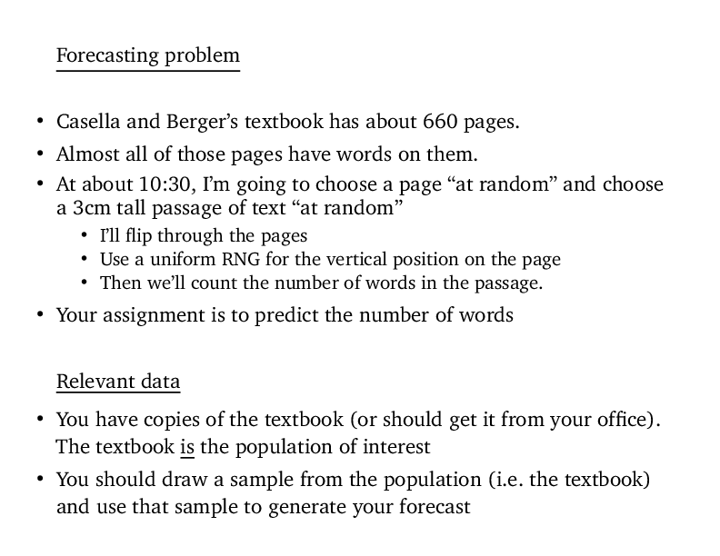
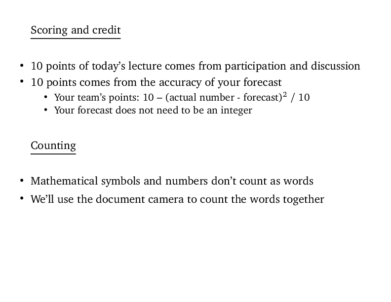
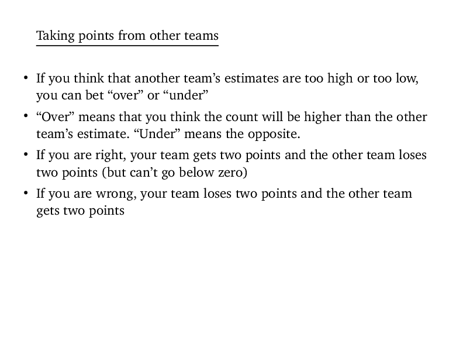
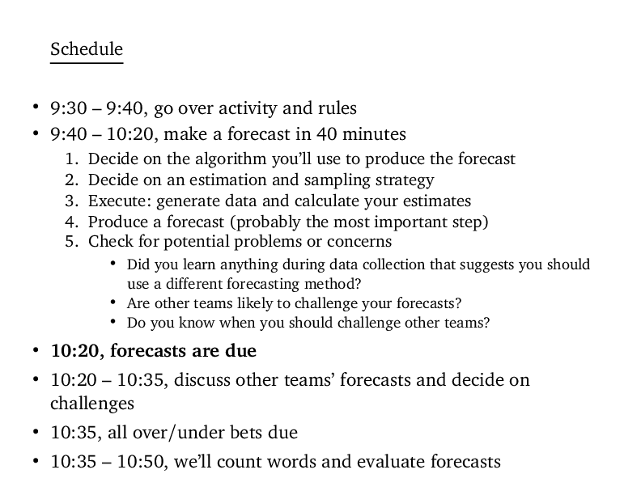

Some short notes I presented to the Iowa State "TBL" meeting; it went
over one of the team activities I've done with my econometrics
class. I got lots of good feedback and suggestions. I presented the
contents of this outline, but as slides.

## Background on the class I teach
+ Started TBL this semester
+ Teach PhD Econometrics (basically a statistics class)
  + Core required class in the Econ department
  + Mostly Economics PhD students (one or two students from other
    departments)
  + 19 students this year (fairly typical class size)
+ 3 teams with 6 to 7 students
+ In first lecture, I sold TBL as a way for the students to get
  experience with "open ended and poorly defined problems," which
  will help them in their research

## Example of one team activity

  

    

  

  

## Some comments
+ There is no "right answer" but there are many, many "wrong
  answers"
+ Potential for an answer being /wrong/ seems more important for
  team's internal discussion than whether or not it can be /right/
+ I'm having trouble getting much discussion between teams, though
  + If teams all choose wildly different approaches, they don't have
    a lot to say to each other
+ This might be addressed with better homework & preparation
  + For HW, students come up with different potential approaches
  + Decide on a list of allowed approaches early in the class period
  + Teams are required to choose and defend one of those options

## Last comments

+ Don't expect students to magically figure out the "right way" to
  handle challenging problems
+ "Problem solving" needs to be taught as well
+ Early on, you may want to split a problem into several small steps
  and lead the students through it
+ Or, make "planning" something that the students are required to do
  and are graded on before "acting"
